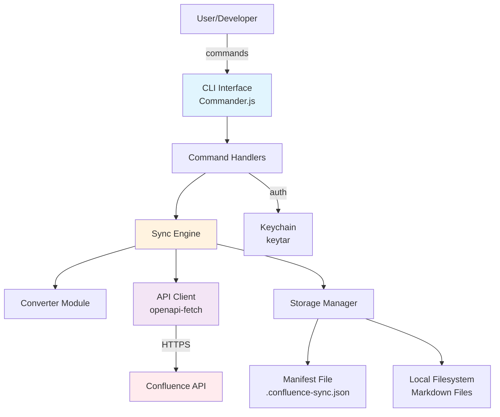

# CLAUDE.md

This file provides guidance to Claude Code (claude.ai/code) when working with code in this repository.

## Project Overview

This is a TypeScript project for syncing with Confluence API, built with Bun runtime. It uses OpenAPI TypeScript generation to create type-safe API client interfaces.

**Important:** While we use Bun as the runtime, we use Node.js import syntax (e.g., `import { readFileSync } from 'node:fs'`) for better compatibility and standards compliance.

## Essential Commands

### Development
- `bun install` - Install dependencies
- `bun run build` - Build the project using zshy (creates dist/ with CJS/ESM outputs and updates package.json exports)
  - **IMPORTANT:** Always run `bun run build` after making changes to ensure dist/ is up-to-date
  - This command automatically generates all necessary files in dist/ directory
  - The build process also updates package.json with correct export paths
- `bun run cli` - Run the CLI tool directly from source
- `bun run lint` - Run ESLint on TypeScript files in src/
- `bun run lint:fix` - Auto-fix linting issues

### OpenAPI Management
- `bun run download:openapi` - Download latest Confluence OpenAPI spec
- `bun run gen:openapi` - Generate TypeScript types from OpenAPI spec (outputs to src/index.ts)

### Testing
- `bun run test` - Run tests with Vitest

## Architecture

### High Level Overview

1. **Architectural Style:** Modular Monolith with plugin-ready architecture - single deployable unit with well-defined internal module boundaries
2. **Repository Structure:** Monorepo as specified in PRD - all components in single repository for atomic commits and simplified dependency management
3. **Service Architecture:** Monolithic CLI application with internal service modules for commands, sync engine, API client, and converters
4. **Primary Flow:** User → CLI Command → Command Handler → Business Logic (Sync Engine) → API Client/Storage → Confluence API
5. **Key Decisions:**
   - Layered architecture for clear separation of concerns
   - Plugin hooks for future extensibility without breaking core
   - Local-first with optimistic operations and conflict detection
   - Async/concurrent operations using Bun's native capabilities

### High Level Project Diagram

### Architectural and Design Patterns

- **Command Pattern:** Each CLI command (pull, push, sync, auth) implemented as discrete command handler with validation, execution, and error handling - *Rationale:* Clear separation of CLI concerns from business logic, testability, and future command additions

- **Repository Pattern:** Abstract data access for manifest and local file operations behind repository interfaces - *Rationale:* Enables testing with mock implementations and potential future migration to SQLite for performance

- **Strategy Pattern:** Format converters (Markdown ↔ Confluence) implemented as pluggable strategies - *Rationale:* Supports future format additions (AsciiDoc, HTML) without modifying core sync logic

- **Observer Pattern:** Event-driven notifications for sync progress and conflict detection - *Rationale:* Enables progress bars, logging, and future webhook integrations without coupling

- **Circuit Breaker Pattern:** API client implements circuit breaker for Confluence API calls - *Rationale:* Prevents cascade failures and respects rate limits automatically

- **Unit of Work Pattern:** Sync operations tracked as atomic units with rollback capability - *Rationale:* Ensures consistency during multi-file operations and enables recovery from partial failures

### Key Files
- `src/api/types.ts` - Auto-generated OpenAPI types (DO NOT EDIT MANUALLY - use `gen:openapi`)
- `src/api/client.ts` - Creates typed OpenAPI fetch client using openapi-fetch
- `src/cli.ts` - CLI entry point (currently minimal implementation)
- `src/openapi/confluence-openapi.json` - Confluence OpenAPI specification (updated via `download:openapi`)

### Build System
- Uses `zshy` bundler-free TypeScript build tool
- Outputs both CommonJS (.cjs) and ES modules (.js) to dist/
- Automatically generates type definitions (.d.ts and .d.cts files)
- Updates package.json exports automatically during build
- TypeScript configured for bundler mode with strict settings
- ESLint configured with @nyxb/eslint-config (indent: 2, quotes: single, semi: true)

### Type Safety
- Strict TypeScript configuration with `noUncheckedIndexedAccess` enabled
- OpenAPI types provide full type safety for Confluence API interactions
- Uses `openapi-fetch` for runtime-safe API calls

## Important Notes
- The project uses Bun runtime with Node.js import syntax (e.g., `node:fs`, `node:path`)
- Always use Node.js-style imports: `import { readFileSync } from 'node:fs'` not `import { readFileSync } from 'fs'`
- src/index.ts is auto-generated - never edit it directly
- API client is configured to use http://localhost:8787 as base URL
- After any code changes, run `bun run build` to update dist/ directory
- The dist/ directory contains:
  - CommonJS files (.cjs)
  - ES modules (.js)
  - TypeScript declarations (.d.ts, .d.cts)
- package.json is automatically updated by zshy during build process
