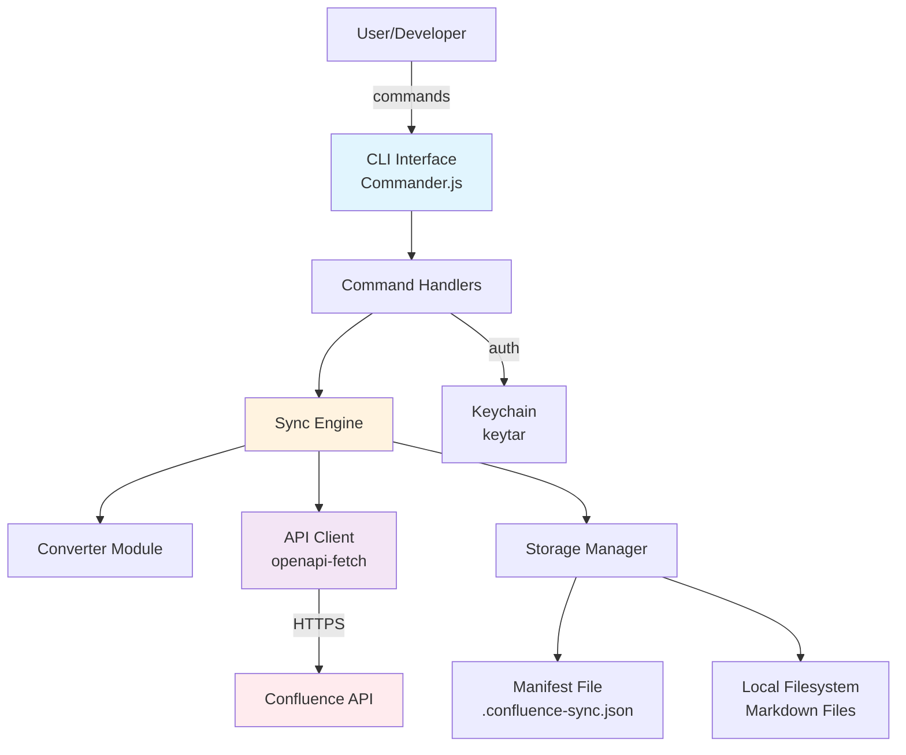
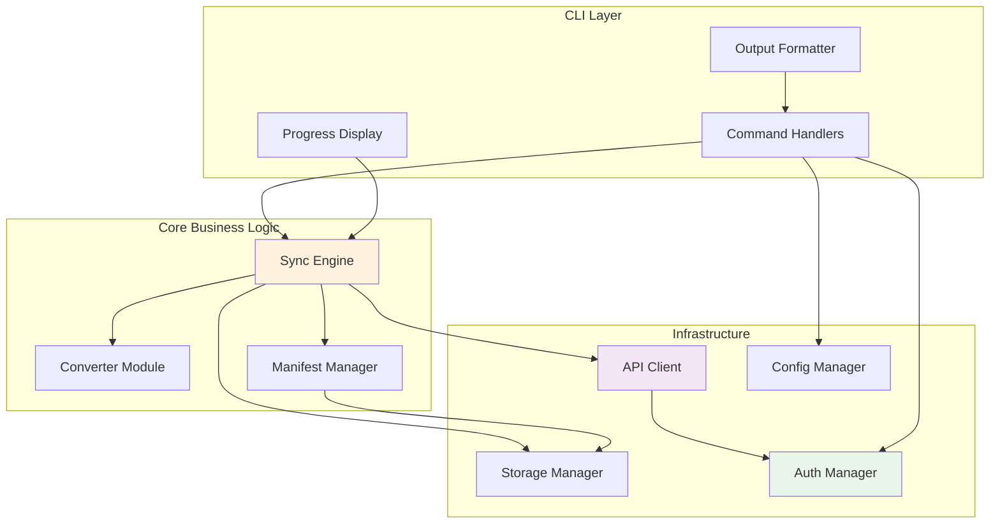
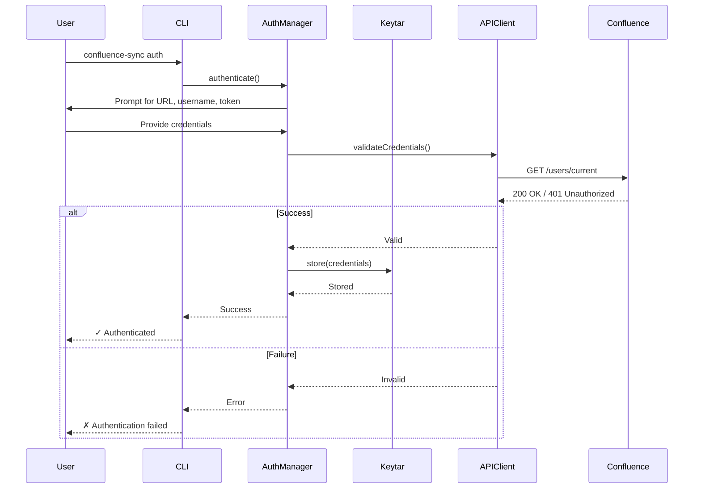
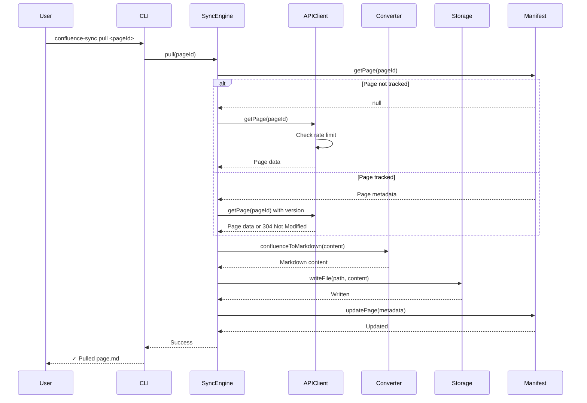
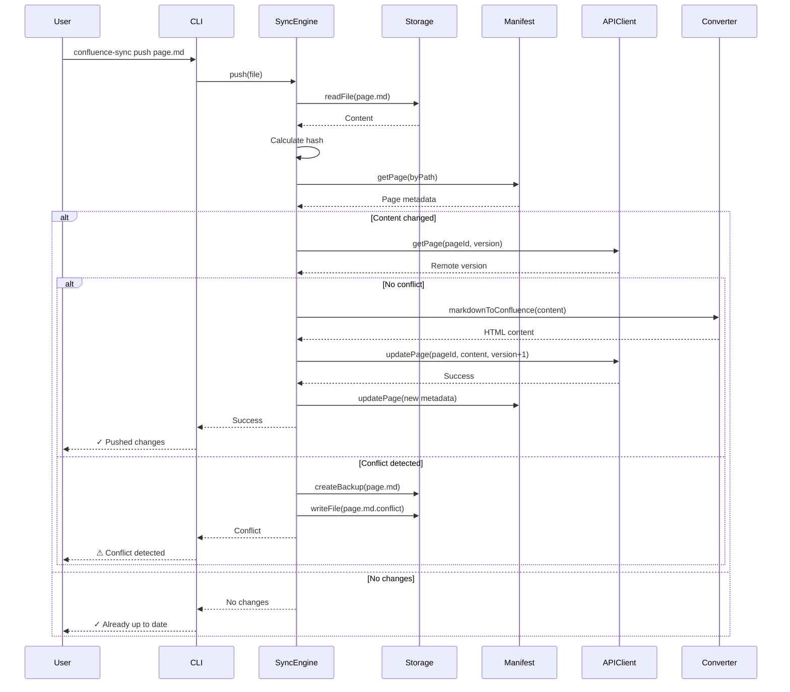
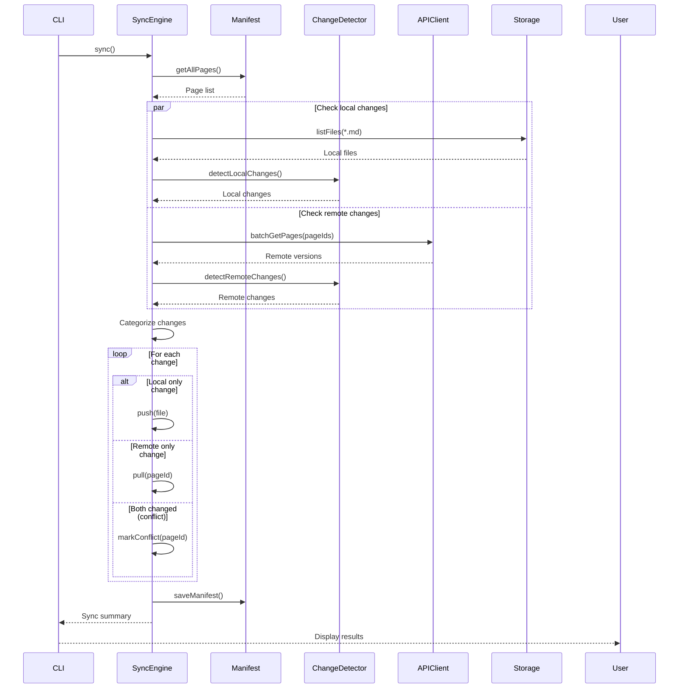

# Confluence Sync Architecture Document

## Introduction

This document outlines the overall project architecture for Confluence Sync, including backend systems, shared services, and non-UI specific concerns. Its primary goal is to serve as the guiding architectural blueprint for AI-driven development, ensuring consistency and adherence to chosen patterns and technologies.

**Relationship to Frontend Architecture:**
If the project includes a significant user interface, a separate Frontend Architecture Document will detail the frontend-specific design and MUST be used in conjunction with this document. Core technology stack choices documented herein (see "Tech Stack") are definitive for the entire project, including any frontend components.

### Starter Template or Existing Project

This project is being built on a custom foundation with Bun/TypeScript already initialized. No formal starter template is being used, but the project has existing configuration including:
- Bun runtime with TypeScript support
- openapi-fetch for API interactions
- zshy build system
- Basic project structure

We'll proceed with architecture design building upon this existing foundation.

### Change Log

| Date | Version | Description | Author |
|------|---------|-------------|--------|
| 2025-08-07 | 1.0 | Initial architecture document | Winston (Architect) |

## High Level Architecture

### Technical Summary

Confluence Sync employs a modular monolithic architecture delivered as a CLI application built on Bun runtime with TypeScript. The system follows a layered architecture pattern with clear separation between command handling, business logic, API interactions, and data persistence. Core architectural patterns include Command pattern for CLI operations, Repository pattern for data access, and Strategy pattern for format conversion. The architecture directly supports PRD goals by enabling offline-capable operations, extensible format support, and efficient concurrent processing while maintaining a simple deployment model suitable for individual developer use.

### High Level Overview

1. **Architectural Style:** Modular Monolith with plugin-ready architecture - single deployable unit with well-defined internal module boundaries
2. **Repository Structure:** Monorepo as specified in PRD - all components in single repository for atomic commits and simplified dependency management
3. **Service Architecture:** Monolithic CLI application with internal service modules for commands, sync engine, API client, and converters
4. **Primary Flow:** User → CLI Command → Command Handler → Business Logic (Sync Engine) → API Client/Storage → Confluence API
5. **Key Decisions:**
   - Layered architecture for clear separation of concerns
   - Plugin hooks for future extensibility without breaking core
   - Local-first with optimistic operations and conflict detection
   - Async/concurrent operations using Bun's native capabilities

### High Level Project Diagram



### Architectural and Design Patterns

- **Command Pattern:** Each CLI command (pull, push, sync, auth) implemented as discrete command handler with validation, execution, and error handling - *Rationale:* Clear separation of CLI concerns from business logic, testability, and future command additions

- **Repository Pattern:** Abstract data access for manifest and local file operations behind repository interfaces - *Rationale:* Enables testing with mock implementations and potential future migration to SQLite for performance

- **Strategy Pattern:** Format converters (Markdown ↔ Confluence) implemented as pluggable strategies - *Rationale:* Supports future format additions (AsciiDoc, HTML) without modifying core sync logic

- **Observer Pattern:** Event-driven notifications for sync progress and conflict detection - *Rationale:* Enables progress bars, logging, and future webhook integrations without coupling

- **Circuit Breaker Pattern:** API client implements circuit breaker for Confluence API calls - *Rationale:* Prevents cascade failures and respects rate limits automatically

- **Unit of Work Pattern:** Sync operations tracked as atomic units with rollback capability - *Rationale:* Ensures consistency during multi-file operations and enables recovery from partial failures

## Tech Stack

### Cloud Infrastructure

- **Provider:** N/A (CLI tool runs locally)
- **Key Services:** NPM Registry for distribution
- **Deployment Regions:** Global via NPM

### Technology Stack Table

| Category | Technology | Version | Purpose | Rationale |
|----------|------------|---------|---------|-----------|
| **Runtime** | Bun | 1.1.0 | JavaScript/TypeScript runtime | Superior performance, built-in TypeScript, faster package installation |
| **Language** | TypeScript | 5.3.3 | Primary development language | Type safety, excellent IDE support, prevents runtime errors |
| **CLI Framework** | Commander.js | 12.0.0 | Command-line interface parsing | Industry standard, declarative API, built-in help generation |
| **API Client** | openapi-fetch | 0.9.0 | Type-safe Confluence API calls | Auto-generated types from OpenAPI spec, lightweight |
| **API Types** | openapi-typescript | 6.7.0 | Generate TypeScript from OpenAPI | Ensures API contract compliance |
| **Build Tool** | zshy | 1.0.0 | TypeScript compilation | Bundler-free, outputs CJS/ESM, simple configuration |
| **Test Framework** | Vitest | 1.2.0 | Unit and integration testing | Bun-compatible, fast, Jest-compatible API |
| **LinterFormatter** | ESLint | 8.56.0 | Code quality and formatting | @nyxb/eslint-config handles both linting and formatting |
| **Format Converter** | unified/remark | 15.0.0 | Markdown processing | Extensible, reliable MD↔HTML conversion |
| **HTML Parser** | node-html-parser | 6.1.0 | Parse Confluence storage format | Fast, lightweight HTML manipulation |
| **Credential Storage** | keytar | 7.9.0 | Secure credential management | OS keychain integration, never plain text |
| **HTTP Client** | Native fetch | Built-in | HTTP requests via openapi-fetch | Bun's optimized native implementation |
| **CLI Utilities** | chalk | 5.3.0 | Colored terminal output | Better UX, error highlighting |
| **Progress Bars** | ora | 8.0.0 | Loading spinners and progress | Clean progress indication |
| **File Watcher** | chokidar | 3.6.0 | Watch mode implementation | Cross-platform, efficient, battle-tested |
| **Config Parser** | yaml | 2.3.0 | Parse .confluence-sync.yml | Human-readable configuration |
| **JSON Schema** | zod | 3.22.0 | Runtime validation | Type-safe config and manifest validation |
| **Concurrency** | p-limit | 5.0.0 | Concurrent operation control | Rate limiting, prevent API overload |
| **Diff Tool** | diff | 5.2.0 | Conflict detection | Text comparison for sync conflicts |

## Data Models

### Page

**Purpose:** Represents a Confluence page with its content, metadata, and sync state

**Key Attributes:**
- `id`: string - Unique Confluence page ID
- `spaceKey`: string - Confluence space identifier
- `title`: string - Page title
- `version`: number - Confluence version number
- `parentId`: string | null - Parent page ID for hierarchy
- `lastModified`: Date - Confluence last modification timestamp
- `localPath`: string - Relative path to local Markdown file
- `contentHash`: string - SHA-256 hash of content for change detection
- `status`: 'synced' | 'modified' | 'conflicted' - Current sync status

**Relationships:**
- Has one parent Page (optional, for hierarchy)
- Has many child Pages (for hierarchy)
- Belongs to one Space

### SyncManifest

**Purpose:** Tracks the overall sync state and configuration for a workspace

**Key Attributes:**
- `version`: string - Manifest schema version for migrations
- `confluenceUrl`: string - Base URL of Confluence instance
- `lastSyncTime`: Date - Timestamp of last successful sync
- `syncMode`: 'manual' | 'watch' - Current operation mode
- `pages`: Map<string, Page> - Indexed collection of tracked pages
- `config`: SyncConfig - User preferences and settings

**Relationships:**
- Contains many Pages
- References one ConfluenceInstance
- Has one SyncConfig

### SyncConfig

**Purpose:** User-configurable settings for sync behavior

**Key Attributes:**
- `profile`: string - Active configuration profile name
- `includePatterns`: string[] - Glob patterns for files to include
- `excludePatterns`: string[] - Glob patterns for files to exclude
- `concurrentOperations`: number - Max parallel API calls (default: 5)
- `conflictStrategy`: 'manual' | 'local-first' | 'remote-first'
- `formatOptions`: FormatConfig - Markdown conversion preferences
- `cacheEnabled`: boolean - Whether to use local caching

**Relationships:**
- Belongs to one SyncManifest
- Configures many SyncOperations

### SyncOperation

**Purpose:** Represents an atomic sync operation for audit and rollback

**Key Attributes:**
- `id`: string - Unique operation identifier (UUID)
- `type`: 'pull' | 'push' | 'sync' - Operation type
- `pageIds`: string[] - Pages involved in operation
- `startTime`: Date - Operation start timestamp
- `endTime`: Date | null - Operation completion timestamp
- `status`: 'pending' | 'in-progress' | 'completed' | 'failed'
- `changes`: ChangeSet[] - List of changes in this operation
- `error`: Error | null - Error details if failed

**Relationships:**
- Affects many Pages
- Contains many ChangeSets
- Created by one User action

### ChangeSet

**Purpose:** Tracks individual changes within a sync operation for granular rollback

**Key Attributes:**
- `pageId`: string - Affected page ID
- `changeType`: 'create' | 'update' | 'delete'
- `direction`: 'local-to-remote' | 'remote-to-local'
- `previousVersion`: number - Version before change
- `newVersion`: number - Version after change
- `previousHash`: string - Content hash before change
- `backup`: string | null - Path to backup file if created

**Relationships:**
- Belongs to one SyncOperation
- Modifies one Page

## Components

### CLI Command Layer

**Responsibility:** Parse and validate user commands, handle CLI-specific concerns like progress display and output formatting

**Key Interfaces:**
- `executeCommand(args: CommandArgs): Promise<void>` - Main command execution
- `displayProgress(operation: SyncOperation): void` - Show progress indicators
- `formatOutput(data: any, format: OutputFormat): string` - Format results for display

**Dependencies:** Sync Engine, Auth Manager, Config Manager

**Technology Stack:** Commander.js for parsing, chalk for colors, ora for progress

### Sync Engine

**Responsibility:** Orchestrate all synchronization operations, manage sync state, detect conflicts, and coordinate between other components

**Key Interfaces:**
- `pull(pageIds: string[], options: PullOptions): Promise<SyncResult>`
- `push(files: string[], options: PushOptions): Promise<SyncResult>`
- `sync(options: SyncOptions): Promise<SyncResult>`
- `detectChanges(): Promise<ChangeSet[]>`
- `resolveConflict(pageId: string, strategy: ConflictStrategy): Promise<void>`

**Dependencies:** API Client, Storage Manager, Converter Module, Manifest Manager

**Technology Stack:** TypeScript core logic, p-limit for concurrency, diff for conflict detection

### API Client

**Responsibility:** Handle all Confluence API interactions with type safety, rate limiting, and error handling

**Key Interfaces:**
- `getPage(pageId: string): Promise<ConfluencePage>`
- `updatePage(pageId: string, content: PageUpdate): Promise<ConfluencePage>`
- `getSpace(spaceKey: string): Promise<Space>`
- `searchPages(query: CQLQuery): Promise<PageSearchResult>`

**Dependencies:** Auth Manager (for credentials)

**Technology Stack:** openapi-fetch with auto-generated types, circuit breaker pattern implementation

### Converter Module

**Responsibility:** Transform content between Markdown and Confluence storage format while preserving formatting fidelity

**Key Interfaces:**
- `markdownToConfluence(markdown: string): Promise<string>`
- `confluenceToMarkdown(html: string): Promise<string>`
- `registerConverter(format: string, converter: Converter): void`

**Dependencies:** None (pure transformation logic)

**Technology Stack:** unified/remark for Markdown, node-html-parser for HTML manipulation

### Storage Manager

**Responsibility:** Manage local file system operations, including reading/writing Markdown files and maintaining directory structure

**Key Interfaces:**
- `readFile(path: string): Promise<string>`
- `writeFile(path: string, content: string): Promise<void>`
- `listFiles(pattern: string): Promise<string[]>`
- `createBackup(path: string): Promise<string>`

**Dependencies:** Manifest Manager (for path mappings)

**Technology Stack:** Bun file APIs, chokidar for file watching

### Manifest Manager

**Responsibility:** Maintain and query the sync manifest, track page metadata and relationships

**Key Interfaces:**
- `loadManifest(): Promise<SyncManifest>`
- `saveManifest(manifest: SyncManifest): Promise<void>`
- `getPage(pageId: string): Page | undefined`
- `updatePageStatus(pageId: string, status: SyncStatus): Promise<void>`
- `migrateManifest(fromVersion: string): Promise<void>`

**Dependencies:** Storage Manager (for file persistence)

**Technology Stack:** zod for schema validation, JSON for serialization

### Auth Manager

**Responsibility:** Handle authentication, credential storage, and token management

**Key Interfaces:**
- `authenticate(credentials: Credentials): Promise<AuthToken>`
- `getToken(): Promise<string>`
- `clearCredentials(): Promise<void>`
- `validateAuth(): Promise<boolean>`

**Dependencies:** Keychain service

**Technology Stack:** keytar for secure storage, OAuth 2.0 implementation for Cloud

### Config Manager

**Responsibility:** Load and manage configuration from files and environment variables

**Key Interfaces:**
- `loadConfig(profile?: string): Promise<SyncConfig>`
- `saveConfig(config: SyncConfig): Promise<void>`
- `switchProfile(profileName: string): Promise<void>`
- `validateConfig(config: unknown): SyncConfig`

**Dependencies:** Storage Manager

**Technology Stack:** yaml parser, zod for validation, dotenv for environment variables

### Component Diagrams



## External APIs

### Confluence REST API

- **Purpose:** Primary interface for all Confluence page operations including reading, writing, and metadata management
- **Documentation:**
  - Cloud: https://developer.atlassian.com/cloud/confluence/rest/v2/
  - Server/Data Center: https://docs.atlassian.com/atlassian-confluence/REST/latest/
- **Base URL(s):**
  - Cloud: `https://{your-domain}.atlassian.net/wiki/api/v2`
  - Server: `https://{your-server}/rest/api`
- **Authentication:**
  - Cloud: OAuth 2.0 or API Token with Basic Auth
  - Server: Personal Access Token or Basic Auth
- **Rate Limits:**
  - Cloud: 5000 requests per hour per user
  - Server: No hard limit (instance-dependent)

**Key Endpoints Used:**
- `GET /pages/{id}` - Retrieve page content and metadata
- `PUT /pages/{id}` - Update existing page content
- `GET /pages/{id}/versions` - Get page version history
- `GET /spaces/{key}/pages` - List pages in a space
- `GET /pages/{id}/children` - Get child pages for hierarchy
- `POST /search/cql` - Search pages using CQL
- `GET /users/current` - Validate authentication

**Integration Notes:**
- Must handle both storage format (XHTML) and view format (HTML)
- Version number must be incremented on updates to prevent conflicts
- Use `expand` parameter to reduce API calls (e.g., `?expand=body.storage,version,ancestors`)
- Implement exponential backoff for rate limit handling
- Cache frequently accessed metadata to minimize API calls

## Core Workflows

### Authentication Workflow



### Pull Operation Workflow



### Push with Conflict Detection



### Bi-directional Sync Workflow



## Database Schema

### Primary Storage: JSON Manifest Schema

```json
{
  "$schema": "http://json-schema.org/draft-07/schema#",
  "type": "object",
  "properties": {
    "version": {
      "type": "string",
      "description": "Manifest schema version",
      "pattern": "^\\d+\\.\\d+\\.\\d+$"
    },
    "confluenceUrl": {
      "type": "string",
      "format": "uri"
    },
    "lastSyncTime": {
      "type": "string",
      "format": "date-time"
    },
    "syncMode": {
      "type": "string",
      "enum": ["manual", "watch"]
    },
    "pages": {
      "type": "object",
      "additionalProperties": {
        "$ref": "#/definitions/Page"
      }
    },
    "config": {
      "$ref": "#/definitions/SyncConfig"
    }
  },
  "required": ["version", "confluenceUrl", "pages"],
  "definitions": {
    "Page": {
      "type": "object",
      "properties": {
        "id": { "type": "string" },
        "spaceKey": { "type": "string" },
        "title": { "type": "string" },
        "version": { "type": "number" },
        "parentId": { "type": ["string", "null"] },
        "lastModified": { "type": "string", "format": "date-time" },
        "localPath": { "type": "string" },
        "contentHash": { "type": "string" },
        "status": {
          "type": "string",
          "enum": ["synced", "modified", "conflicted"]
        }
      },
      "required": ["id", "spaceKey", "title", "version", "localPath", "contentHash", "status"]
    },
    "SyncConfig": {
      "type": "object",
      "properties": {
        "profile": { "type": "string" },
        "includePatterns": {
          "type": "array",
          "items": { "type": "string" }
        },
        "excludePatterns": {
          "type": "array",
          "items": { "type": "string" }
        },
        "concurrentOperations": {
          "type": "number",
          "minimum": 1,
          "maximum": 10,
          "default": 5
        },
        "conflictStrategy": {
          "type": "string",
          "enum": ["manual", "local-first", "remote-first"]
        }
      }
    }
  }
}
```

### Configuration File Schema (.confluence-sync.yml)

```yaml
# YAML configuration schema
profiles:
  default:
    confluenceUrl: https://company.atlassian.net/wiki
    concurrentOperations: 5
    conflictStrategy: manual
    includePatterns:
      - '**/*.md'
    excludePatterns:
      - '**/node_modules/**'
      - '**/.git/**'

  personal:
    confluenceUrl: https://personal.atlassian.net/wiki
    concurrentOperations: 3
    conflictStrategy: local-first

activeProfile: default
```

## Source Tree

```
confluence-sync/
├── .github/
│   └── workflows/
│       ├── ci.yml                    # Test and lint on PR
│       └── release.yml                # NPM publish on tag
├── src/
│   ├── commands/                     # CLI command implementations
│   │   ├── auth.ts                   # Authentication command
│   │   ├── pull.ts                   # Pull command
│   │   ├── push.ts                   # Push command
│   │   ├── sync.ts                   # Sync command
│   │   ├── status.ts                 # Status command
│   │   ├── config.ts                 # Config management command
│   │   └── index.ts                  # Command registry
│   ├── api/                          # Confluence API layer
│   │   ├── client.ts                 # openapi-fetch client setup
│   │   ├── types.ts                  # Auto-generated Confluence types
│   │   ├── circuit-breaker.ts        # Circuit breaker implementation
│   │   └── rate-limiter.ts           # Rate limiting logic
│   ├── sync/                         # Core sync engine
│   │   ├── engine.ts                 # Main sync orchestrator
│   │   ├── change-detector.ts        # Change detection logic
│   │   ├── conflict-resolver.ts      # Conflict handling
│   │   └── operations.ts             # Sync operation tracking
│   ├── converters/                   # Format conversion
│   │   ├── markdown-to-confluence.ts # MD → Confluence HTML
│   │   ├── confluence-to-markdown.ts # Confluence HTML → MD
│   │   ├── converter-registry.ts     # Plugin registration
│   │   └── utils.ts                  # Shared conversion utilities
│   ├── storage/                      # File system operations
│   │   ├── file-manager.ts           # File I/O operations
│   │   ├── manifest-manager.ts       # Manifest CRUD
│   │   ├── backup-manager.ts         # Backup creation/restoration
│   │   └── watcher.ts                # File system watching
│   ├── auth/                         # Authentication management
│   │   ├── auth-manager.ts           # Auth orchestration
│   │   ├── keychain.ts               # Keytar integration
│   │   └── oauth.ts                  # OAuth flow for Cloud
│   ├── config/                       # Configuration management
│   │   ├── config-manager.ts         # Config loading/validation
│   │   ├── profiles.ts               # Profile management
│   │   └── schemas.ts                # Zod schemas for validation
│   ├── utils/                        # Shared utilities
│   │   ├── logger.ts                 # Logging utility
│   │   ├── errors.ts                 # Custom error classes
│   │   ├── hash.ts                   # Content hashing
│   │   └── progress.ts               # Progress indicators
│   ├── cli.ts                        # CLI entry point
│   └── index.ts                      # Main exports
├── tests/
│   ├── unit/                         # Unit tests (mirrors src/)
│   │   ├── converters/
│   │   ├── sync/
│   │   └── utils/
│   ├── integration/                  # Integration tests
│   │   ├── api/
│   │   └── sync/
│   └── fixtures/                     # Test data
│       ├── confluence-pages/
│       └── markdown-files/
├── scripts/                          # Development scripts
│   ├── download-openapi.ts           # Download Confluence OpenAPI
│   ├── generate-types.ts             # Generate TypeScript from OpenAPI
│   └── test-confluence.ts            # Manual testing utilities
├── docs/                             # Documentation
│   ├── prd.md                        # Product Requirements
│   ├── architecture.md               # This document
│   └── api/                          # API documentation
├── dist/                             # Build output (gitignored)
│   ├── cjs/                          # CommonJS build
│   └── esm/                          # ES Modules build
├── .confluence-sync.json             # Example manifest (gitignored)
├── .confluence-sync.yml              # Example config
├── .env.example                      # Environment variables template
├── .eslintrc.js                      # ESLint configuration
├── .gitignore
├── CLAUDE.md                         # AI development instructions
├── LICENSE
├── README.md
├── package.json                      # NPM package definition
├── tsconfig.json                     # TypeScript configuration
└── vitest.config.ts                  # Test configuration
```

## Infrastructure and Deployment

### Infrastructure as Code

- **Tool:** GitHub Actions workflows
- **Location:** `.github/workflows/`
- **Approach:** Declarative YAML workflows for CI/CD automation

### Deployment Strategy

- **Strategy:** Continuous deployment on tagged releases
- **CI/CD Platform:** GitHub Actions
- **Pipeline Configuration:** `.github/workflows/release.yml`

### Environments

- **Development:** Local development with Bun runtime, hot reload via `bun run`
- **Testing:** GitHub Actions runners for automated testing on PR
- **Staging:** Pre-release versions published to NPM with beta tag
- **Production:** Stable releases published to NPM with latest tag

### Environment Promotion Flow

```
Local Dev → Feature Branch → PR (CI Tests) → Main Branch →
Release Tag → NPM Beta → Manual Testing → NPM Latest
```

### Rollback Strategy

- **Primary Method:** NPM version rollback (`npm install confluence-sync@previous-version`)
- **Trigger Conditions:** Critical bugs, data corruption issues, API breaking changes
- **Recovery Time Objective:** < 5 minutes (user reinstalls previous version)

## Error Handling Strategy

### General Approach

- **Error Model:** Custom error classes extending base Error with error codes
- **Exception Hierarchy:** ConfluenceSyncError → (AuthError, APIError, SyncError, ConfigError, FileError)
- **Error Propagation:** Errors bubble up to command layer for user presentation

### Logging Standards

- **Library:** Console with chalk for now (consider winston for future)
- **Format:** `[timestamp] [level] [component] message {context}`
- **Levels:** ERROR, WARN, INFO, DEBUG, TRACE
- **Required Context:**
  - Correlation ID: UUID per command execution
  - Service Context: Component name
  - User Context: No PII, only anonymous session ID

### Error Handling Patterns

#### External API Errors

- **Retry Policy:** Exponential backoff with jitter, max 3 retries
- **Circuit Breaker:** Open after 5 consecutive failures, half-open after 30s
- **Timeout Configuration:** 30s for single page, 5min for bulk operations
- **Error Translation:** Map HTTP status codes to user-friendly messages

#### Business Logic Errors

- **Custom Exceptions:** ConflictError, ValidationError, PermissionError
- **User-Facing Errors:** Clear action items (e.g., "Run 'confluence-sync auth' to authenticate")
- **Error Codes:** CS-XXX format (CS-001: Auth failed, CS-002: Network error, etc.)

#### Data Consistency

- **Transaction Strategy:** Atomic manifest updates, rollback on failure
- **Compensation Logic:** Restore backups on failed push operations
- **Idempotency:** All operations safe to retry, using version checks

## Coding Standards

### Core Standards

- **Languages & Runtimes:** TypeScript 5.3.3 on Bun 1.1.0 (strict mode enabled)
- **Style & Linting:** ESLint with @nyxb/eslint-config (2-space indent, single quotes, semicolons)
- **Test Organization:** Tests in `tests/unit/{module}/*.test.ts` mirroring src structure

### Naming Conventions

| Element | Convention | Example |
|---------|------------|---------|
| Files | kebab-case | `sync-engine.ts` |
| Classes | PascalCase | `SyncEngine` |
| Interfaces | PascalCase | `SyncOptions` |
| Functions | camelCase | `detectChanges()` |
| Constants | UPPER_SNAKE_CASE | `MAX_RETRIES` |
| Private fields | underscore prefix | `_manifest` |

### Critical Rules

- **Never use console.log:** Always use the logger utility from `src/utils/logger.ts`
- **Always use apliClient for API calls:** Never use fetch directly, use `src/api/client.ts`
- **All API responses must use type guards:** Never cast API responses directly, validate with zod schemas
- **Database queries must use ManifestManager:** Never read/write .confluence-sync.json directly
- **All file paths must be absolute:** Use path.resolve() for all file system operations
- **Error messages must include error codes:** Every thrown error must have a CS-XXX code
- **Never store credentials in code:** All auth data must go through AuthManager/keytar
- **Always handle rate limits:** Every API call must go through the rate-limited client
- **Format conversion must preserve data:** Never lose content during MD↔HTML conversion

## Test Strategy and Standards

### Testing Philosophy

- **Approach:** Test-after development with mandatory coverage before merge
- **Coverage Goals:** 80% for core modules, 60% for utilities
- **Test Pyramid:** 70% unit, 20% integration, 10% E2E

### Test Types and Organization

#### Unit Tests

- **Framework:** Vitest 1.2.0
- **File Convention:** `{module}.test.ts` in tests/unit/{module}/
- **Location:** tests/unit/ mirroring src/ structure
- **Mocking Library:** vitest built-in mocks
- **Coverage Requirement:** 80% for sync/, converters/, 60% for utils/

**AI Agent Requirements:**
- Generate tests for all public methods
- Cover edge cases and error conditions
- Follow AAA pattern (Arrange, Act, Assert)
- Mock all external dependencies

#### Integration Tests

- **Scope:** API client, manifest persistence, converter accuracy
- **Location:** tests/integration/
- **Test Infrastructure:**
  - **Confluence API:** Mock server using MSW (Mock Service Worker)
  - **File System:** Temp directories using Bun.tempdir()
  - **Keychain:** Mock keytar implementation

#### End-to-End Tests

- **Scope:** Critical user workflows (auth, pull, push, sync)
- **Environment:** Local test Confluence instance or sandbox
- **Test Data:** Fixtures in tests/fixtures/

### Test Data Management

- **Strategy:** Fixtures for predictable tests, factories for dynamic data
- **Fixtures:** tests/fixtures/ with sample Confluence pages and markdown
- **Factories:** Test data builders for complex objects
- **Cleanup:** Automatic cleanup after each test using afterEach hooks

### Continuous Testing

- **CI Integration:** All tests run on every PR
- **Performance Tests:** Benchmark sync operations with 50+ pages
- **Security Tests:** Credential handling, no secrets in logs

## Security

### Input Validation

- **Validation Library:** zod for all external inputs
- **Validation Location:** Command layer before processing
- **Required Rules:**
  - All external inputs MUST be validated
  - Validation at API boundary before processing
  - Whitelist approach preferred over blacklist

### Authentication & Authorization

- **Auth Method:** API tokens stored in system keychain via keytar
- **Session Management:** Stateless - credentials retrieved per operation
- **Required Patterns:**
  - Never store tokens in files or environment variables
  - Validate auth on every API call
  - Clear credentials on auth failure

### Secrets Management

- **Development:** .env files (gitignored) for test credentials only
- **Production:** System keychain via keytar
- **Code Requirements:**
  - NEVER hardcode secrets
  - Access via AuthManager only
  - No secrets in logs or error messages

### API Security

- **Rate Limiting:** Built-in rate limiter respecting Confluence limits
- **CORS Policy:** N/A (CLI tool, not web service)
- **Security Headers:** N/A (CLI tool)
- **HTTPS Enforcement:** All API calls use HTTPS only

### Data Protection

- **Encryption at Rest:** Rely on OS file system encryption
- **Encryption in Transit:** HTTPS for all API communication
- **PII Handling:** No user PII stored locally, only page IDs and content
- **Logging Restrictions:** Never log credentials, API tokens, or user content

### Dependency Security

- **Scanning Tool:** npm audit / Snyk for vulnerability scanning
- **Update Policy:** Security patches applied immediately
- **Approval Process:** New dependencies reviewed for security/license

### Security Testing

- **SAST Tool:** ESLint security plugins
- **DAST Tool:** N/A (CLI tool)
- **Penetration Testing:** Community-driven security reviews

## Checklist Results Report

### Executive Summary

- **Overall Architecture Readiness:** HIGH
- **Project Type:** Backend CLI Tool (Frontend sections N/A)
- **Critical Risks:** None identified
- **Key Strengths:**
  - Comprehensive modular design with clear component boundaries
  - Strong security focus with keychain integration
  - Well-defined error handling and testing strategies
  - Excellent AI agent implementation suitability

### Section Analysis

| Section | Pass Rate | Status | Notes |
|---------|-----------|--------|-------|
| 1. Requirements Alignment | 100% | ✅ PASS | All PRD requirements addressed |
| 2. Architecture Fundamentals | 100% | ✅ PASS | Clear diagrams, patterns, modularity |
| 3. Technical Stack & Decisions | 100% | ✅ PASS | Specific versions, justified choices |
| 4. Frontend Design | N/A | - | CLI tool, no frontend |
| 5. Resilience & Operations | 95% | ✅ PASS | Comprehensive error handling |
| 6. Security & Compliance | 100% | ✅ PASS | Strong credential protection |
| 7. Implementation Guidance | 100% | ✅ PASS | Clear standards and practices |
| 8. Dependency Management | 90% | ✅ PASS | Dependencies well managed |
| 9. AI Agent Suitability | 100% | ✅ PASS | Excellent clarity for AI implementation |
| 10. Accessibility | N/A | - | CLI tool, no UI |

### Risk Assessment

**Low Risk Items:**
1. **SQLite Migration Path** - JSON manifest may need optimization for 1000+ pages
   - *Mitigation:* Schema designed for easy SQLite migration when needed
2. **Rate Limiting at Scale** - 5000 req/hour may limit large space operations
   - *Mitigation:* Circuit breaker and exponential backoff implemented
3. **Format Conversion Fidelity** - Complex Confluence macros not fully supported in MVP
   - *Mitigation:* Clear MVP scope, post-MVP roadmap includes full macro support

### Recommendations

**Must-Fix:** None - architecture is ready for development

**Should-Consider:**
- Add structured logging library (winston/pino) for production debugging
- Consider binary distribution via pkg for non-npm users
- Add performance benchmarks for large-scale operations

**Nice-to-Have:**
- GraphQL consideration for future Confluence API v3
- Plugin architecture detailed specification for community extensions

### AI Implementation Readiness

**Strengths for AI Implementation:**
- Components sized appropriately for single AI agent sessions
- Clear interfaces and single responsibilities
- Explicit coding standards prevent common AI mistakes
- Test requirements guide AI-generated tests
- Security rules embedded to prevent credential leaks

**Areas of Excellence:**
- File structure clearly defined with ASCII diagram
- Naming conventions explicitly stated
- Error codes standardized (CS-XXX format)
- Critical rules section prevents common pitfalls

### Final Assessment

✅ **READY FOR DEVELOPMENT**

The architecture is comprehensive, well-structured, and ready for implementation. The design is particularly well-suited for AI agent development with clear boundaries, explicit standards, and comprehensive guidance. All PRD requirements are addressed with appropriate technical solutions.

## Next Steps

### Development Team Prompt

Begin implementing the Confluence Sync CLI tool following the architecture at @docs/architecture.md. Start with Epic 1 Story 1.1 (Project Foundation & CLI Bootstrap) from the PRD. Key points:

1. Use Bun 1.2.0 runtime with TypeScript 5.3.3
2. Follow the source tree structure exactly as specified
3. Implement components in this order: CLI layer → Auth Manager → API Client → Storage Manager
4. All credentials must use keytar, never store in files
5. Use the coding standards section for all development
6. Generate tests achieving 80% coverage for core modules

Focus on delivering Epic 1 (Foundation & Core Sync) first to provide immediate value with basic pull/push operations.
