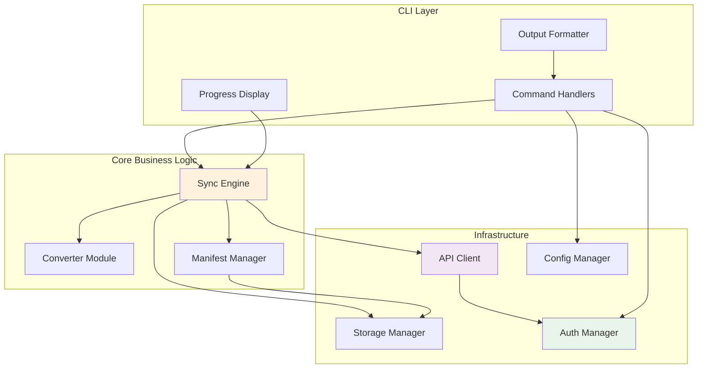

# Components

## CLI Command Layer

**Responsibility:** Parse and validate user commands, handle CLI-specific concerns like progress display and output formatting

**Key Interfaces:**
- `executeCommand(args: CommandArgs): Promise<void>` - Main command execution
- `displayProgress(operation: SyncOperation): void` - Show progress indicators
- `formatOutput(data: any, format: OutputFormat): string` - Format results for display

**Dependencies:** Sync Engine, Auth Manager, Config Manager

**Technology Stack:** Commander.js for parsing, chalk for colors, ora for progress

## Sync Engine

**Responsibility:** Orchestrate all synchronization operations, manage sync state, detect conflicts, and coordinate between other components

**Key Interfaces:**
- `pull(pageIds: string[], options: PullOptions): Promise<SyncResult>`
- `push(files: string[], options: PushOptions): Promise<SyncResult>`
- `sync(options: SyncOptions): Promise<SyncResult>`
- `detectChanges(): Promise<ChangeSet[]>`
- `resolveConflict(pageId: string, strategy: ConflictStrategy): Promise<void>`

**Dependencies:** API Client, Storage Manager, Converter Module, Manifest Manager

**Technology Stack:** TypeScript core logic, p-limit for concurrency, diff for conflict detection

## API Client

**Responsibility:** Handle all Confluence API interactions with type safety, rate limiting, and error handling

**Key Interfaces:**
- `getPage(pageId: string): Promise<ConfluencePage>`
- `updatePage(pageId: string, content: PageUpdate): Promise<ConfluencePage>`
- `getSpace(spaceKey: string): Promise<Space>`
- `searchPages(query: CQLQuery): Promise<PageSearchResult>`

**Dependencies:** Auth Manager (for credentials)

**Technology Stack:** openapi-fetch with auto-generated types, circuit breaker pattern implementation

## Converter Module

**Responsibility:** Transform content between Markdown and Confluence storage format while preserving formatting fidelity

**Key Interfaces:**
- `markdownToConfluence(markdown: string): Promise<string>`
- `confluenceToMarkdown(html: string): Promise<string>`
- `registerConverter(format: string, converter: Converter): void`

**Dependencies:** None (pure transformation logic)

**Technology Stack:** unified/remark for Markdown, node-html-parser for HTML manipulation

## Storage Manager

**Responsibility:** Manage local file system operations, including reading/writing Markdown files and maintaining directory structure

**Key Interfaces:**
- `readFile(path: string): Promise<string>`
- `writeFile(path: string, content: string): Promise<void>`
- `listFiles(pattern: string): Promise<string[]>`
- `createBackup(path: string): Promise<string>`

**Dependencies:** Manifest Manager (for path mappings)

**Technology Stack:** Bun file APIs, chokidar for file watching

## Manifest Manager

**Responsibility:** Maintain and query the sync manifest, track page metadata and relationships

**Key Interfaces:**
- `loadManifest(): Promise<SyncManifest>`
- `saveManifest(manifest: SyncManifest): Promise<void>`
- `getPage(pageId: string): Page | undefined`
- `updatePageStatus(pageId: string, status: SyncStatus): Promise<void>`
- `migrateManifest(fromVersion: string): Promise<void>`

**Dependencies:** Storage Manager (for file persistence)

**Technology Stack:** zod for schema validation, JSON for serialization

## Auth Manager

**Responsibility:** Handle authentication, credential storage, and token management

**Key Interfaces:**
- `authenticate(credentials: Credentials): Promise<AuthToken>`
- `getToken(): Promise<string>`
- `clearCredentials(): Promise<void>`
- `validateAuth(): Promise<boolean>`

**Dependencies:** Keychain service

**Technology Stack:** keytar for secure storage, OAuth 2.0 implementation for Cloud

## Config Manager

**Responsibility:** Load and manage configuration from files and environment variables

**Key Interfaces:**
- `loadConfig(profile?: string): Promise<SyncConfig>`
- `saveConfig(config: SyncConfig): Promise<void>`
- `switchProfile(profileName: string): Promise<void>`
- `validateConfig(config: unknown): SyncConfig`

**Dependencies:** Storage Manager

**Technology Stack:** yaml parser, zod for validation, dotenv for environment variables

## Component Diagrams

