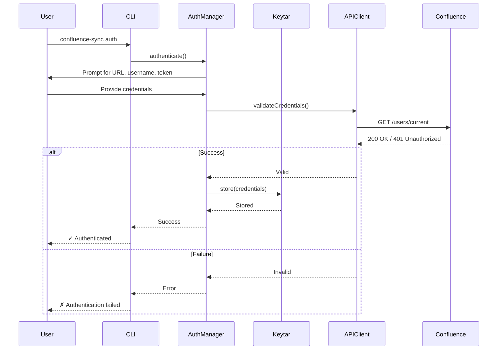
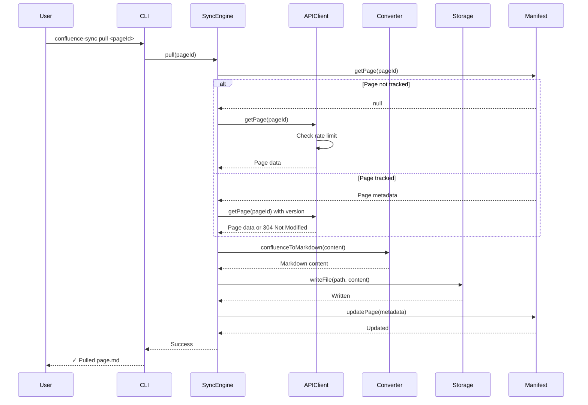
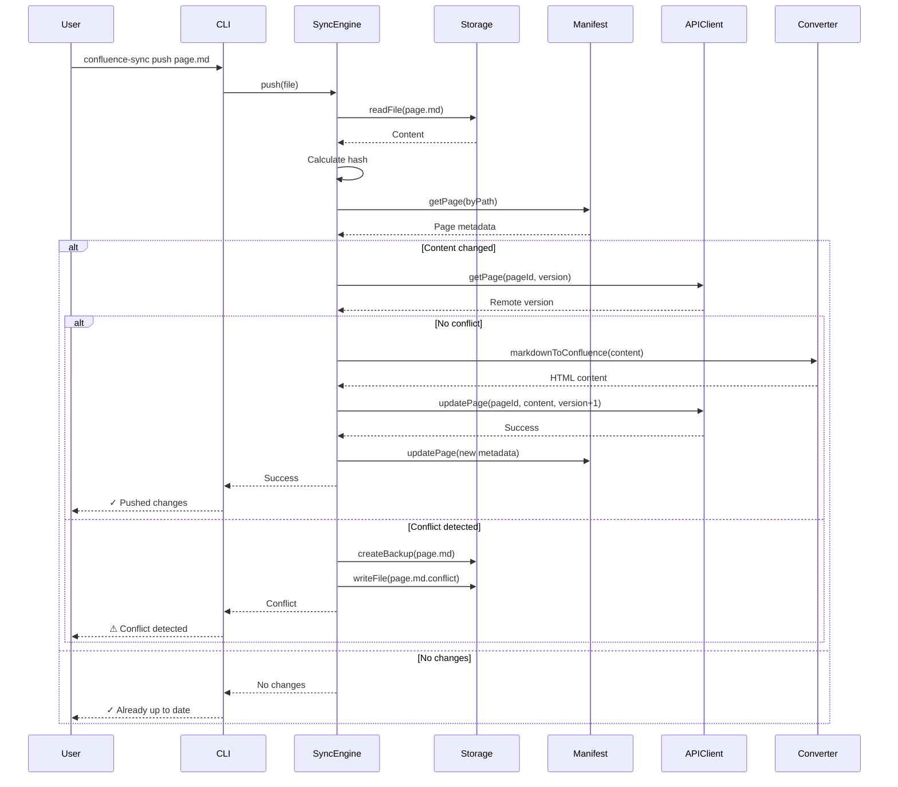
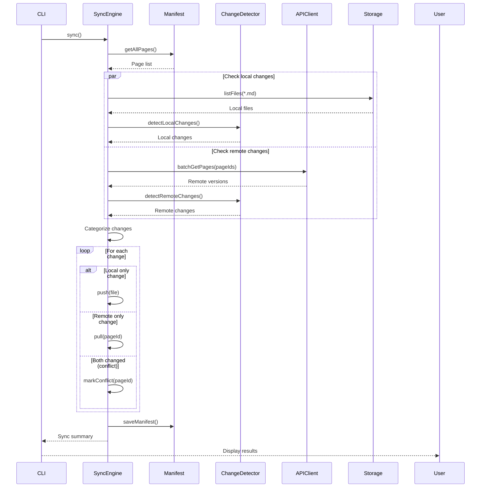

# Core Workflows

## Authentication Workflow

```mermaid
sequenceDiagram
    participant User
    participant CLI
    participant AuthManager
    participant Keytar
    participant APIClient
    participant Confluence

    User->>CLI: confluence-sync auth
    CLI->>AuthManager: authenticate()
    AuthManager->>User: Prompt for URL, username, token
    User->>AuthManager: Provide credentials
    AuthManager->>APIClient: validateCredentials()
    APIClient->>Confluence: GET /users/current
    Confluence-->>APIClient: 200 OK / 401 Unauthorized

    alt Success
        APIClient-->>AuthManager: Valid
        AuthManager->>Keytar: store(credentials)
        Keytar-->>AuthManager: Stored
        AuthManager-->>CLI: Success
        CLI-->>User: ✓ Authenticated
    else Failure
        APIClient-->>AuthManager: Invalid
        AuthManager-->>CLI: Error
        CLI-->>User: ✗ Authentication failed
    end
```

## Pull Operation Workflow

```mermaid
sequenceDiagram
    participant User
    participant CLI
    participant SyncEngine
    participant APIClient
    participant Converter
    participant Storage
    participant Manifest

    User->>CLI: confluence-sync pull <pageId>
    CLI->>SyncEngine: pull(pageId)
    SyncEngine->>Manifest: getPage(pageId)

    alt Page not tracked
        Manifest-->>SyncEngine: null
        SyncEngine->>APIClient: getPage(pageId)
        APIClient->>APIClient: Check rate limit
        APIClient-->>SyncEngine: Page data
    else Page tracked
        Manifest-->>SyncEngine: Page metadata
        SyncEngine->>APIClient: getPage(pageId) with version
        APIClient-->>SyncEngine: Page data or 304 Not Modified
    end

    SyncEngine->>Converter: confluenceToMarkdown(content)
    Converter-->>SyncEngine: Markdown content
    SyncEngine->>Storage: writeFile(path, content)
    Storage-->>SyncEngine: Written
    SyncEngine->>Manifest: updatePage(metadata)
    Manifest-->>SyncEngine: Updated
    SyncEngine-->>CLI: Success
    CLI-->>User: ✓ Pulled page.md
```

## Push with Conflict Detection

```mermaid
sequenceDiagram
    participant User
    participant CLI
    participant SyncEngine
    participant Storage
    participant Manifest
    participant APIClient
    participant Converter

    User->>CLI: confluence-sync push page.md
    CLI->>SyncEngine: push(file)
    SyncEngine->>Storage: readFile(page.md)
    Storage-->>SyncEngine: Content
    SyncEngine->>SyncEngine: Calculate hash
    SyncEngine->>Manifest: getPage(byPath)
    Manifest-->>SyncEngine: Page metadata

    alt Content changed
        SyncEngine->>APIClient: getPage(pageId, version)
        APIClient-->>SyncEngine: Remote version

        alt No conflict
            SyncEngine->>Converter: markdownToConfluence(content)
            Converter-->>SyncEngine: HTML content
            SyncEngine->>APIClient: updatePage(pageId, content, version+1)
            APIClient-->>SyncEngine: Success
            SyncEngine->>Manifest: updatePage(new metadata)
            SyncEngine-->>CLI: Success
            CLI-->>User: ✓ Pushed changes
        else Conflict detected
            SyncEngine->>Storage: createBackup(page.md)
            SyncEngine->>Storage: writeFile(page.md.conflict)
            SyncEngine-->>CLI: Conflict
            CLI-->>User: ⚠ Conflict detected
        end
    else No changes
        SyncEngine-->>CLI: No changes
        CLI-->>User: ✓ Already up to date
    end
```

## Bi-directional Sync Workflow

```mermaid
sequenceDiagram
    participant CLI
    participant SyncEngine
    participant Manifest
    participant ChangeDetector
    participant APIClient
    participant Storage

    CLI->>SyncEngine: sync()
    SyncEngine->>Manifest: getAllPages()
    Manifest-->>SyncEngine: Page list

    par Check local changes
        SyncEngine->>Storage: listFiles(*.md)
        Storage-->>SyncEngine: Local files
        SyncEngine->>ChangeDetector: detectLocalChanges()
        ChangeDetector-->>SyncEngine: Local changes
    and Check remote changes
        SyncEngine->>APIClient: batchGetPages(pageIds)
        APIClient-->>SyncEngine: Remote versions
        SyncEngine->>ChangeDetector: detectRemoteChanges()
        ChangeDetector-->>SyncEngine: Remote changes
    end

    SyncEngine->>SyncEngine: Categorize changes

    loop For each change
        alt Local only change
            SyncEngine->>SyncEngine: push(file)
        else Remote only change
            SyncEngine->>SyncEngine: pull(pageId)
        else Both changed (conflict)
            SyncEngine->>SyncEngine: markConflict(pageId)
        end
    end

    SyncEngine->>Manifest: saveManifest()
    SyncEngine-->>CLI: Sync summary
    CLI-->>User: Display results
```
