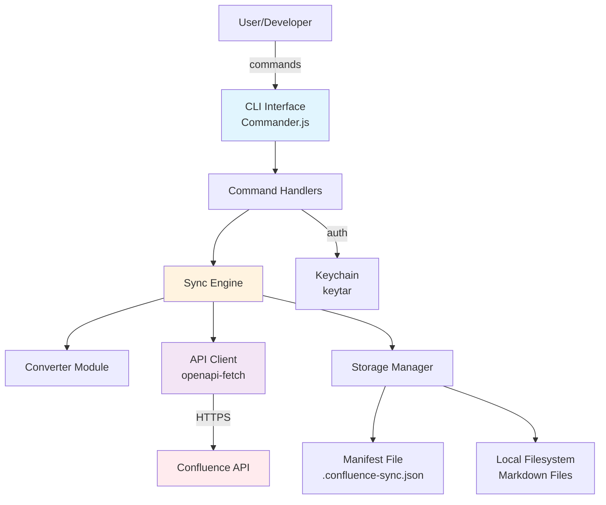

# High Level Architecture

## Technical Summary

Confluence Sync employs a modular monolithic architecture delivered as a CLI application built on Bun runtime with TypeScript. The system follows a layered architecture pattern with clear separation between command handling, business logic, API interactions, and data persistence. Core architectural patterns include Command pattern for CLI operations, Repository pattern for data access, and Strategy pattern for format conversion. The architecture directly supports PRD goals by enabling offline-capable operations, extensible format support, and efficient concurrent processing while maintaining a simple deployment model suitable for individual developer use.

## High Level Overview

1. **Architectural Style:** Modular Monolith with plugin-ready architecture - single deployable unit with well-defined internal module boundaries
2. **Repository Structure:** Monorepo as specified in PRD - all components in single repository for atomic commits and simplified dependency management
3. **Service Architecture:** Monolithic CLI application with internal service modules for commands, sync engine, API client, and converters
4. **Primary Flow:** User → CLI Command → Command Handler → Business Logic (Sync Engine) → API Client/Storage → Confluence API
5. **Key Decisions:**
   - Layered architecture for clear separation of concerns
   - Plugin hooks for future extensibility without breaking core
   - Local-first with optimistic operations and conflict detection
   - Async/concurrent operations using Bun's native capabilities

## High Level Project Diagram

## Architectural and Design Patterns

- **Command Pattern:** Each CLI command (pull, push, sync, auth) implemented as discrete command handler with validation, execution, and error handling - *Rationale:* Clear separation of CLI concerns from business logic, testability, and future command additions

- **Repository Pattern:** Abstract data access for manifest and local file operations behind repository interfaces - *Rationale:* Enables testing with mock implementations and potential future migration to SQLite for performance

- **Strategy Pattern:** Format converters (Markdown ↔ Confluence) implemented as pluggable strategies - *Rationale:* Supports future format additions (AsciiDoc, HTML) without modifying core sync logic

- **Observer Pattern:** Event-driven notifications for sync progress and conflict detection - *Rationale:* Enables progress bars, logging, and future webhook integrations without coupling

- **Circuit Breaker Pattern:** API client implements circuit breaker for Confluence API calls - *Rationale:* Prevents cascade failures and respects rate limits automatically

- **Unit of Work Pattern:** Sync operations tracked as atomic units with rollback capability - *Rationale:* Ensures consistency during multi-file operations and enables recovery from partial failures
